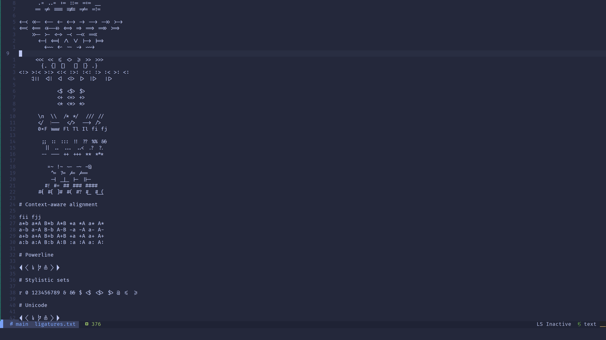
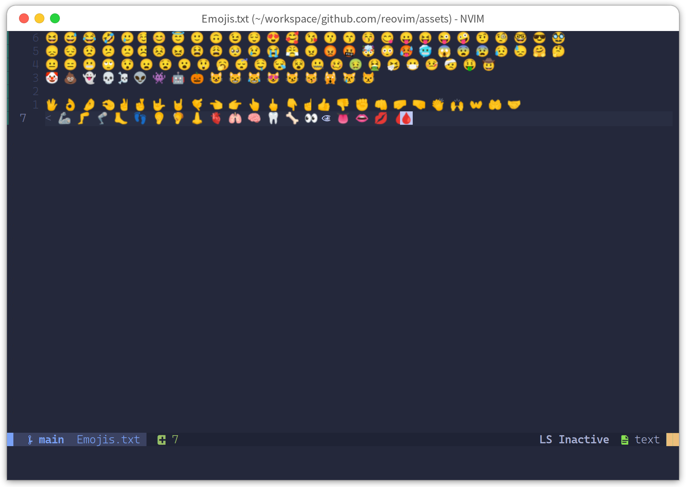

# Reovim
Neovim GUI written in Rust, using relm4 and gtk4-rs.

Thanks [Neovide](https://github.com/neovide/neovide)

## Configuration

To setup font add next line to `init.vim`
```vim
set guifont=Cascadia\ Code,Symbols\ Nerd\ Font\ Mono\ Light:h12
```
or `init.lua`

```lua
vim.opt.guifont="Cascadia Code, Symbols Nerd Font Mono Light:h12"
```

## Install

### Build prerequisites

#### Linux

First install the GTK development packages. On Debian/Ubuntu derivatives
this can be done as follows:

```sh
sudo apt install libgtk-4-dev>=4.6 libadwaita-1-dev>=1.0 clang
```

On Arch Linux derivatives this can be done as follows:
```sh
pacman -S gtk4 libadwaita clang pkg-config
```

Then install the latest rust compiler, best with the
[rustup tool](https://rustup.rs/). The build command:

```
cargo install --git https://github.com/songww/reovim
```

## Features

### Ligatures

Supports ligatures and font shaping.



### Emoji Support

Font fallback supports rendering of emoji not contained in the configured font.



## Planing

- [ ]  Animated Cursor. [example](https://github.com/neovide/neovide#animated-cursor)  
- [ ]  Animated Windows. [example](https://github.com/neovide/neovide#animated-windows)  
- [ ]  Smooth scrolling.  
- [ ]  Copy selections.  
- [ ]  Paste from clipboards.  
- [ ]  Better font rendering.  
